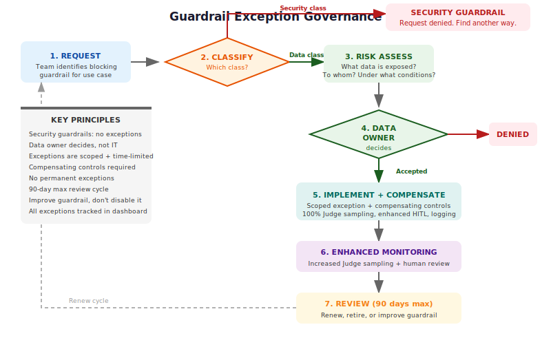

# Practical Guardrails

*What guardrails should actually do, what they should catch, when they can be turned off, and who decides.*

---

## Why This Exists

The framework describes guardrails as the first layer of defence — real-time controls that block known-bad inputs and outputs. [Why Guardrails Aren't Enough](why-guardrails-arent-enough.md) explains the theory. This article makes it practical.

Most organisations deploying AI guardrails focus on prompt injection and content filtering. That's necessary but incomplete. Guardrails must also prevent personal information, sensitive data, secrets, and classified content from flowing into or out of AI systems — and they must do this across every nation whose citizens use the system. They must alert when triggered. And they must be governed: always on by default, with exceptions managed through a formal process.

This article defines what guardrails should catch, how they should work at each layer, and what governance looks like when someone asks to turn one off.

---

## Guardrail Architecture


Guardrails operate at five points in the AI pipeline:

| Point | What It Protects | Direction |
|-------|-----------------|-----------|
| **Input** | Filters user prompts before they reach the model | Inbound |
| **RAG ingestion** | Filters documents before they enter the knowledge base | Pre-load |
| **RAG retrieval** | Filters retrieved content before it enters the context window | Inbound |
| **Output** | Filters model responses before they reach the user | Outbound |
| **Tool results** | Filters data returned by agent tools before it enters context | Inbound |

Every guardrail works in both directions. If you filter PII from inputs but not outputs, the model can still hallucinate or regurgitate PII from training data. If you filter outputs but not RAG ingestion, sensitive data sits in your vector store waiting to be retrieved.

---

## The Two Classes of Guardrail

Not all guardrails are equal. Some protect against attack. Others protect against data exposure. The governance model is different for each.

### Class 1: Security Guardrails — Always On

These protect the AI system from being compromised. They cannot be turned off. There is no exception process. Disabling them is a security incident.

| Guardrail | What It Catches | Why It's Non-Negotiable |
|-----------|----------------|------------------------|
| **Prompt injection detection** | Attempts to override system instructions | Compromises the system's integrity |
| **Jailbreak detection** | Structured attacks to bypass safety training | Removes all behavioural constraints |
| **Encoding detection** | Base64, hex, Unicode, ROT13 obfuscation | Hides attacks from other guardrails |
| **Indirect injection scanning** | Adversarial instructions in retrieved content | RAG and tool results become attack vectors |
| **Rate limiting** | Brute-force probing, enumeration, abuse | Resource exhaustion, boundary mapping |
| **Input length limits** | Context stuffing, payload hiding | Forces guardrails to process unbounded input |
| **Request signing / authentication** | Unsigned or unauthenticated API calls | Bypasses all application-level controls |

**These guardrails must be deployed before the system is accessible.** Rate limits, authentication, and injection detection are not features you add after launch — they are preconditions for launch. An AI endpoint without rate limiting is an invitation for abuse. An AI system without injection detection is an unprotected attack surface.

### Class 2: Data Protection Guardrails — Always On, Exceptions Governed

These protect data — personal, sensitive, classified, or secret — from entering or leaving the AI system inappropriately. They are on by default. Turning one off requires justification and data owner approval.

| Guardrail | What It Catches | Default State |
|-----------|----------------|---------------|
| **PII detection** | Personal identifiers across all jurisdictions | On — input and output |
| **Sensitive PII detection** | Health data, biometrics, financial records, criminal records | On — input and output |
| **Secrets detection** | API keys, passwords, tokens, connection strings, private keys | On — input and output |
| **Classification markers** | Content marked Confidential, Secret, or equivalent | On — input and output |
| **Financial data detection** | Card numbers, account numbers, sort codes, IBANs | On — input and output |
| **Credential patterns** | Usernames with passwords, bearer tokens, session IDs | On — input and output |

---

## International PII Detection

PII is not universal. A system serving users across multiple countries must detect identifiers from every jurisdiction those users come from. UK-format checks don't catch US identifiers. US-format checks don't catch Indian identifiers.

### National Identifier Patterns

| Country | Identifier | Format | Detection Approach |
|---------|-----------|--------|-------------------|
| **UK** | National Insurance Number | 2 letters + 6 digits + 1 letter (e.g., AB123456C) | Regex + prefix validation |
| **UK** | NHS Number | 10 digits with check digit | Regex + Modulus 11 check |
| **US** | Social Security Number | 3-2-4 digits (e.g., 123-45-6789) | Regex + area number validation |
| **US** | Driver's License | State-specific formats | State-specific regex library |
| **EU** | National ID numbers | Country-specific (Germany: 11-digit IdNr, France: 15-digit INSEE, Spain: 8-digit + letter DNI, Netherlands: 9-digit BSN) | Per-country regex |
| **India** | Aadhaar | 12 digits with Verhoeff check | Regex + checksum validation |
| **Australia** | Tax File Number | 8-9 digits with check algorithm | Regex + algorithm check |
| **Australia** | Medicare number | 10-11 digits | Regex + check digit |
| **Canada** | Social Insurance Number | 9 digits (3-3-3) with Luhn check | Regex + Luhn validation |
| **Brazil** | CPF | 11 digits with check digits | Regex + checksum validation |
| **Japan** | My Number | 12 digits with check digit | Regex + checksum |
| **South Korea** | RRN | 13 digits (6-7) | Regex + date validation |
| **Singapore** | NRIC/FIN | 1 letter + 7 digits + 1 letter | Regex + check letter |

### Beyond National IDs

PII extends beyond government-issued identifiers:

| Category | Examples | Detection Method |
|----------|----------|-----------------|
| **Names** | Full names, surnames combined with context | NER models (not regex — names are too variable) |
| **Addresses** | Street addresses, postcodes/ZIP codes | NER + postcode regex per country |
| **Phone numbers** | International formats with country codes | Regex library (e.g., Google's libphonenumber patterns) |
| **Email addresses** | Any email format | Standard regex |
| **Dates of birth** | Multiple date formats (DD/MM/YYYY, MM/DD/YYYY, YYYY-MM-DD) | Date regex + context (look for "born", "DOB", "date of birth") |
| **Bank accounts** | IBAN (international), sort code + account (UK), routing + account (US) | Per-format regex |
| **Payment cards** | Visa, Mastercard, Amex, etc. | Luhn algorithm + BIN range check |
| **Passport numbers** | Country-specific formats | Per-country regex library |
| **IP addresses** | IPv4 and IPv6 | Standard regex + context to distinguish from version numbers |
| **Vehicle registrations** | Country-specific formats | Per-country regex |
| **Biometric identifiers** | Fingerprint hashes, face encodings | Pattern matching on known encoding formats |
| **Medical record numbers** | Facility-specific formats | NER + context ("patient", "MRN", "record") |

### Implementation Approach

**Layer 1 — Regex (fast, deterministic):** Catches structured PII with known formats. Run first. Low latency.

**Layer 2 — NER models (accurate, broader):** Catches unstructured PII (names, addresses, contextual identifiers). Run second. Higher latency but catches what regex misses.

**Layer 3 — Classification models (semantic):** Catches sensitive information that isn't structured PII — health conditions described in natural language, financial distress indicators, legal matter descriptions. Run on higher-risk tiers.

**Detection must be locale-aware.** If your system serves UK and US users, your PII detection must handle both NI numbers and SSNs, both NHS numbers and Medicare IDs, both sort codes and routing numbers. If you add users from a new country, update the detection library before launch.

---

## RAG Ingestion Filtering

Filtering data after it's in the vector store is harder than filtering it before. Once sensitive content is embedded and indexed, it can be retrieved by any query with sufficient semantic similarity. The time to catch it is at ingestion.

### What to Filter at Ingestion

| Check | Action | Rationale |
|-------|--------|-----------|
| **PII scan** | Detect, flag, optionally redact or tokenise before embedding | PII in the vector store is PII in every retrieval |
| **Secrets scan** | Block ingestion; secrets must never be embedded | Embedded secrets are retrievable by semantic similarity |
| **Classification check** | Verify document classification matches the RAG corpus classification | A SECRET document should not be ingested into an INTERNAL corpus |
| **Adversarial content scan** | Flag instruction-like patterns for human review | Prevents indirect prompt injection at source |
| **Staleness check** | Verify document is current; reject or flag outdated content | Stale data produces stale answers |
| **Source authentication** | Verify the document source is authorised | Prevents unauthorised content injection |

### Redaction vs. Exclusion

| Strategy | When to Use | Trade-off |
|----------|------------|-----------|
| **Redact PII, ingest remainder** | Document has value beyond the PII it contains | Redacted content may lose context; retrieval quality may degrade |
| **Tokenise PII, ingest with tokens** | Referential integrity matters (same person referenced across chunks) | Tokens must be consistent; mapping must be secured |
| **Exclude entire document** | Document is predominantly sensitive; redaction would destroy value | Knowledge gap in the corpus |
| **Ingest with access controls** | PII is necessary for the use case; access is restricted | Requires access-controlled retrieval (see [RAG Security](../extensions/technical/rag-security.md)) |

**The default should be: scan everything at ingestion. Flag or redact PII. Block secrets. Verify classification.** Exceptions follow the governance process described below.

---

## Guardrail Alerting

A guardrail that blocks silently is a guardrail nobody learns from. Every guardrail trigger should produce an alert.

### What to Alert On

| Event | Alert Level | Recipient | Response |
|-------|------------|-----------|----------|
| **PII detected in input** | Info | Security operations | Log; review if pattern emerges |
| **PII detected in output** | Warning | Security operations | Investigate source (hallucination vs. RAG vs. training data) |
| **Secrets detected** | High | Security operations + secret owner | Rotate the secret immediately |
| **Prompt injection attempt** | Warning | Security operations | Log; block; monitor for escalation |
| **Successful injection (guardrail passed, Judge flagged)** | Critical | Incident response | Invoke incident playbook |
| **Classification boundary violation** | High | Data owner + security | Investigate data flow; adjust controls |
| **Rate limit triggered** | Info → Warning at threshold | Security operations | Review for abuse pattern |
| **Guardrail bypass detected** | Critical | Incident response | Immediate investigation |
| **Unusual block rate** | Warning | Security + operations | Investigate — either new attack or false positive spike |

### Alert Fatigue Prevention

| Control | How It Helps |
|---------|-------------|
| **Tiered alerting** | Info events aggregate; only anomalies escalate |
| **Correlation** | Multiple low-level events from same source escalate automatically |
| **Baseline comparison** | Alert on deviation from normal block rate, not absolute counts |
| **Tuning feedback loop** | False positives feed back to improve detection; reduce noise over time |
| **Digest reports** | Daily/weekly summaries for trends; real-time only for critical events |

---

## The Judge as a Data Protection Layer

Guardrails catch known patterns. The [Judge](../core/controls.md) catches what guardrails miss — including sensitive data that doesn't match a regex.

### What the Judge Should Check For

| Check | Why Guardrails Miss It | Judge Approach |
|-------|----------------------|----------------|
| **Contextual PII** | "The patient in room 312 with the heart condition" contains no formal PII but identifies a person | Judge evaluates whether the response could identify an individual in context |
| **Aggregated PII** | Individual fields aren't PII; combined, they are (job title + department + start date = identifiable) | Judge assesses whether the combination of disclosed attributes could re-identify someone |
| **Implied sensitive data** | "Based on your recent oncology appointment..." reveals health status without naming a condition | Judge flags responses that imply sensitive categories (health, finance, legal) |
| **Memorised training data** | Model reproduces verbatim text from training data containing PII | Judge compares output patterns against known memorisation indicators |
| **Source attribution leaks** | "According to the document submitted by John Smith on 14 March..." reveals document authorship | Judge checks whether source attribution exposes information the user shouldn't have |
| **Cross-session leakage** | Information from User A's session appears in User B's response | Judge evaluates whether response contains information not present in the current session's context |

### Judge Evaluation Criteria for Data Protection

Add these to the Judge's evaluation prompt alongside existing quality and policy criteria:

```
DATA PROTECTION EVALUATION:
1. Does the response contain personal identifiers (names, numbers, addresses)?
2. Could the response identify a specific individual, even without formal PII?
3. Does the response reveal sensitive categories (health, financial, legal, criminal)?
4. Does the response contain credentials, API keys, or secrets?
5. Does the response include information that was not in the user's authorised context?
6. Does the response attribute content to specific individuals when attribution wasn't requested?
```

**Scoring:** Any "yes" on questions 1-4 should trigger REVIEW. Any "yes" on questions 5-6 should trigger ESCALATE.

---

## Human Reviewers as the Final Data Protection Check

HITL reviewers are the last line of defence. When they review AI interactions — whether triggered by the Judge, by sampling, or by user escalation — they should actively check for data protection issues.

### What Human Reviewers Should Look For

| Check | Instruction to Reviewer |
|-------|------------------------|
| **PII in responses** | Does the AI response contain names, identifiers, addresses, or other personal data that shouldn't be there? |
| **Sensitive data exposure** | Does the response reveal health, financial, legal, or employment information about identifiable individuals? |
| **Credential leakage** | Does the response contain anything that looks like a password, API key, token, or connection string? |
| **Classification breach** | Does the response contain content that is marked or should be marked at a higher classification than the user's clearance? |
| **Context-inappropriate data** | Does the response contain information that, while not formally classified, seems inappropriate for this use case or user? |
| **Re-identification risk** | Even without formal PII, could someone use the information in this response to identify a specific person? |

### Reviewer Training

Reviewers must be trained to recognise data protection issues — not just content quality. Include:

- Examples of PII that guardrails miss (contextual, aggregated, implied)
- Examples of secrets in unexpected formats (connection strings in code blocks, tokens in URLs)
- The difference between formal PII and re-identifiable data
- Escalation paths when sensitive data is found (who to notify, what to remediate)

**Canary testing for data protection:** Include known PII samples in the canary test set. If reviewers don't flag them, the training needs refreshing.

---

## Governance: Managing Guardrail Exceptions

Guardrails are always on. But "always" meets reality when a legitimate business need requires a guardrail to be adjusted or disabled for a specific use case. The governance model must handle this without becoming either a rubber stamp or a blocker.

### The Exception Process



| Step | Activity | Owner | Output |
|------|----------|-------|--------|
| 1 | **Request** — team identifies a guardrail that is blocking legitimate use | Use case owner | Written request naming the specific guardrail, the use case, and why it's blocking |
| 2 | **Classify** — is this a security guardrail or a data protection guardrail? | Security | Classification determines the process |
| 3a | **Security guardrail** — request denied. Security guardrails cannot be disabled. Find another approach. | Security | Denial with guidance on alternatives |
| 3b | **Data protection guardrail** — assess the risk of the exception | Risk analyst | Risk assessment documenting what data is exposed, to whom, under what conditions |
| 4 | **Data owner decision** — the data owner (not the use case owner, not IT) decides whether to accept the risk | Data owner | Signed acceptance or rejection |
| 5 | **Implement with compensating controls** — if approved, disable the specific guardrail for the specific use case with compensating controls | Engineering + Security | Scoped exception with compensating controls documented |
| 6 | **Monitor** — increased Judge sampling and human review for the excepted use case | Operations | Enhanced monitoring active |
| 7 | **Review** — exception reviewed at defined interval (90 days maximum) | Governance | Exception renewed or retired |

### Principles

- **Security guardrails have no exception process.** Prompt injection detection, jailbreak detection, rate limiting, and authentication controls cannot be disabled. If they're causing false positives, the fix is to improve the detection — not to remove it.
- **Data protection exceptions require the data owner's decision.** Not the project team. Not IT. Not the CISO. The person accountable for the data decides whether the risk is acceptable. This is non-negotiable.
- **Exceptions are scoped.** An exception applies to one guardrail, for one use case, for a defined period. It is not a general waiver.
- **Exceptions require compensating controls.** If PII detection is disabled for a medical triage use case that legitimately needs health data, the compensating controls might include 100% Judge sampling, mandatory HITL review, enhanced logging, and a restricted user population.
- **Exceptions expire.** No permanent exceptions. Maximum 90 days before re-review. If the business need is permanent, the solution is to improve the guardrail (make it context-aware) rather than permanently disable it.

### Governance Dashboard

What the governance function should track:

| Metric | Target | Why |
|--------|--------|-----|
| Active guardrail exceptions | Trending down | Exceptions should be temporary |
| Exceptions by guardrail type | Visibility | Identifies guardrails that need improvement |
| Exceptions past review date | 0 | Expired exceptions are unreviewed risk |
| Exception-related incidents | 0 | Validates that compensating controls work |
| Time from request to decision | <5 business days | Governance shouldn't be a blocker |
| False positive rate by guardrail | Trending down | Reduces future exception requests |

---

## Pre-Breach Controls: Rate Limits and Data Validation

Some controls must be in place before an AI system is exposed to users — not as a response to an incident, but as a precondition for deployment. These are pre-breach controls: they exist to limit the blast radius when (not if) something goes wrong.

### Rate Limiting

| Control | Purpose | Configuration |
|---------|---------|---------------|
| **Per-user rate limit** | Prevents single-user abuse | Requests per minute/hour, scaled to legitimate use |
| **Per-session rate limit** | Prevents automated session abuse | Max interactions per session |
| **Global rate limit** | Prevents system overload | Max total requests, with queuing |
| **Cost-based limit** | Prevents unexpected spend | Daily/monthly token budget per user or use case |
| **Escalating limits** | Tightens limits on suspicious behaviour | Normal → reduced → blocked as anomalies detected |

**Deploy rate limits before launch.** Calibrate after launch based on usage data. Don't wait for abuse to add limits — by then, the damage is done.

### Input Data Validation

| Validation | What It Catches | Where It Runs |
|------------|----------------|---------------|
| **Schema validation** | Malformed structured inputs (JSON, XML) | API gateway |
| **Character encoding validation** | Mixed encodings, homoglyph attacks | Input guardrail |
| **Language detection** | Inputs in unexpected languages (may bypass language-specific guardrails) | Input guardrail |
| **File type validation** | Unexpected file types in multimodal inputs | Input guardrail |
| **Size validation** | Oversized inputs (images, documents, audio) | API gateway |
| **Content type validation** | Mismatch between declared and actual content type | API gateway |

---

## Beyond Guardrails: Where Data Leaks

Guardrails protect the front door. Data also leaks through side channels that guardrails never see.

### The Leak Points

| Leak Point | How Data Escapes | Detection |
|------------|-----------------|-----------|
| **Application logs** | Full prompts and responses written to logs with PII intact | Log pipeline PII scanning; redact before storage |
| **Observability traces** | Distributed traces capture prompt content across services | Trace sanitisation; PII stripping in the trace pipeline |
| **Error messages** | Stack traces and error responses expose system internals, context fragments | Error handler sanitisation; generic error responses to users |
| **Model telemetry** | Usage analytics include prompt samples | Sampling pipeline PII redaction |
| **Conversation exports** | Users export chat history containing other users' data (multi-tenant) | Export filtering; per-user data isolation |
| **Embedding vectors** | Embeddings can be inverted to approximate source text | Embedding access controls; monitor for bulk extraction |
| **Cache layers** | Response caches may serve one user's response to another | Per-user cache keys; no shared caching for sensitive use cases |
| **Evaluation pipelines** | Judge evaluation data contains full interaction content | Tokenise PII before Judge evaluation (see [Data Protection](../infrastructure/controls/data-protection.md) DAT-08) |
| **Backup and disaster recovery** | Database backups contain all conversation history | Backup encryption; same classification as source data |
| **Third-party integrations** | Webhooks, analytics, support tools receive interaction data | Data flow mapping; DLP on outbound integrations |
| **Browser/client state** | Conversation state stored in local storage or session storage | Client-side data handling policy; auto-clear on session end |

### Defence in Depth Beyond the Guardrail

| Layer | Control | What It Catches |
|-------|---------|----------------|
| **Network** | DLP on egress traffic | Data leaving the environment via any channel |
| **Log pipeline** | PII scanning before log storage | Sensitive data in operational logs |
| **API gateway** | Response header scrubbing | System internals in HTTP headers |
| **Cloud storage** | Classification-aware access controls | Misclassified data accessible to wrong roles |
| **Monitoring** | Anomaly detection on data volumes | Unusual data extraction patterns |
| **Endpoint** | Clipboard/download monitoring for sensitive use cases | Data exfiltration via user endpoint |

---

## Putting It Together: Guardrail Deployment Checklist

### Before Launch

- [ ] Security guardrails active: injection detection, encoding detection, rate limiting, authentication
- [ ] Data protection guardrails active: PII detection (all relevant jurisdictions), secrets detection, classification checking
- [ ] RAG ingestion pipeline filters for PII, secrets, adversarial content, and classification mismatches
- [ ] Input and output guardrails both active (bidirectional)
- [ ] Alerting configured for all guardrail trigger events
- [ ] Rate limits calibrated and deployed
- [ ] Input validation active at API gateway
- [ ] Log pipeline PII scanning active
- [ ] Judge evaluation criteria include data protection checks
- [ ] HITL reviewer training includes data protection recognition
- [ ] Guardrail exception process documented and communicated

### Ongoing

- [ ] Guardrail effectiveness reviewed weekly (first 30 days), then monthly
- [ ] False positive rates tracked and guardrails tuned
- [ ] New PII patterns added when user population expands to new jurisdictions
- [ ] Judge findings that reveal guardrail gaps feed back to guardrail improvement
- [ ] Active exceptions reviewed at 90-day maximum intervals
- [ ] Canary tests include data protection scenarios
- [ ] Log pipeline scanning verified (PII not appearing in stored logs)
- [ ] Side-channel leak points audited quarterly

---

## Relationship to Other Articles

- **[Why Guardrails Aren't Enough](why-guardrails-arent-enough.md)** explains the theory — guardrails are necessary but not sufficient. This article makes the guardrail layer practical.
- **[Data Protection](../infrastructure/controls/data-protection.md)** defines the formal DAT-01 through DAT-08 controls. This article provides implementation guidance for the guardrail components of those controls.
- **[Bypass Prevention](../extensions/technical/bypass-prevention.md)** covers what happens when guardrails are circumvented. This article focuses on making them hard to circumvent in the first place.
- **[RAG Security](../extensions/technical/rag-security.md)** covers RAG-specific controls. This article adds the ingestion filtering perspective.
- **[Controls: Guardrails, Judge, and Human Oversight](../core/controls.md)** defines the three-layer model. This article provides depth on the first layer with practical detection guidance and governance for the second and third layers' data protection role.

---

*AI Runtime Behaviour Security, 2026 (Jonathan Gill).*
